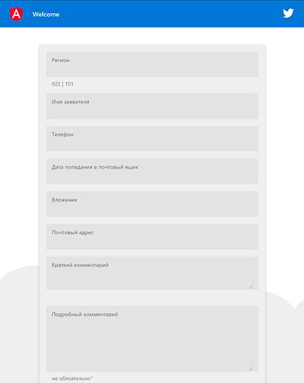

# StpApp

### Image source
`Available images:`
<a href="docs/pageScreen.jpg" rel="some text">
  
</a>

### Backend

```sh
    cd Backend
    npm install
```

## Run simple
```sh
    node app.js
```
Output:
```
Running at Port 3036
```

Open page: http://localhost:3036/

## Run Docker 

### Compose
```sh
docker-compose up
```

### Docker

Background runing
```sh
docker build . -t stp-app-img
docker run -d --name stp-app -p 3036:3036 stp-app-img
```
or interactive 
```sh
docker build . -t stp-app-img
# Запустим и присоединимся к контейнеру, для запуска в нем команд
docker run -it --name proxy-stp -p 3036:3036 stp-app-img bash
```
Тест
```sh
curl http://localhost:3036
```
Удаление контейнера и образа
```sh
docker rm -f proxy-stp stp-app
docker image rm -f stp-app-img stpapp-form_webapp
```


## Development server

This project was generated with [Angular CLI](https://github.com/angular/angular-cli) version 10.0.2.

Run `ng serve` for a dev server. Navigate to `http://localhost:4200/`. The app will automatically reload if you change any of the source files.

## Code scaffolding

Run `ng generate component component-name` to generate a new component. You can also use `ng generate directive|pipe|service|class|guard|interface|enum|module`.

## Build

Run `ng build` to build the project. The build artifacts will be stored in the `dist/` directory. Use the `--prod` flag for a production build.

## Running unit tests

Run `ng test` to execute the unit tests via [Karma](https://karma-runner.github.io).

## Running end-to-end tests

Run `ng e2e` to execute the end-to-end tests via [Protractor](http://www.protractortest.org/).

## Further help

To get more help on the Angular CLI use `ng help` or go check out the [Angular CLI README](https://github.com/angular/angular-cli/blob/master/README.md).
